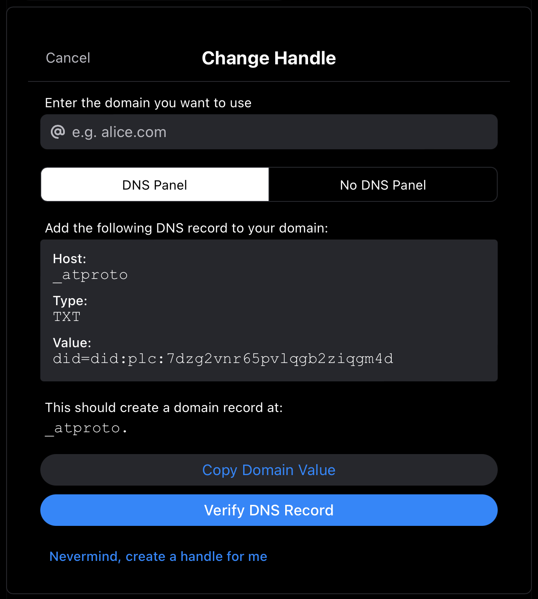
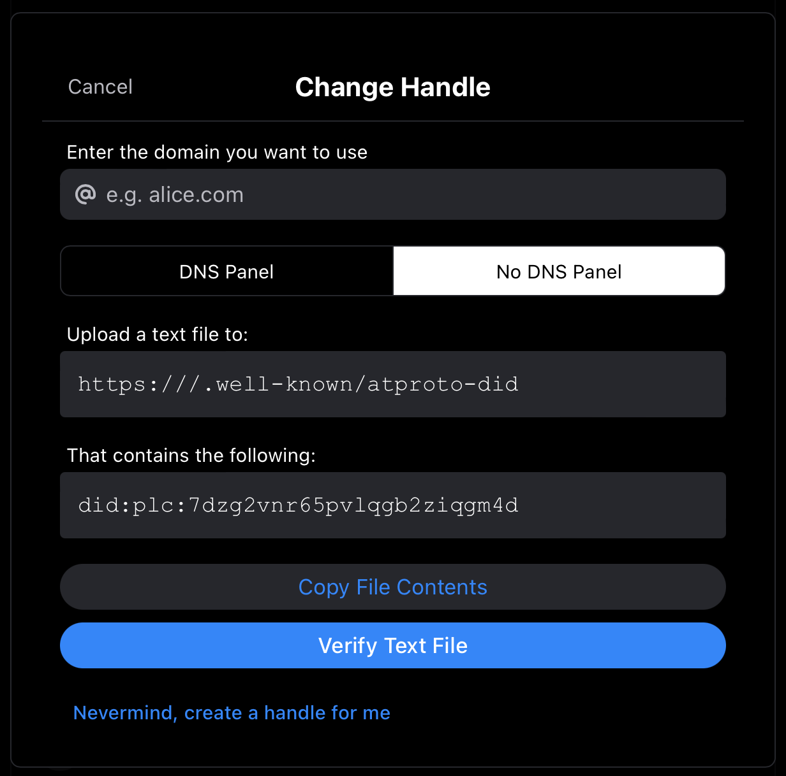

_(Screw the blog, just [show me the demo](https://demo-bsky-domain-handle.jacklorusso.com))_

I love that you can set your domain as your handle with Bluesky (or more correctly, the AT Protocol). Identity on the web is a solved problem — so let's use the platform and leverage the Domain Name System (DNS).

You're reading this on [jacklorusso.com](/). On Bluesky, I'm [@jacklorusso.com](https://bsky.app/profile/jacklorusso.com). Any account that is owned by me, such as [my art bot project 'Helvetica Bot'](/posts/resurrection-of-helvetica-bot/) will be easily verifiable as mine because it will have a handle that is a subdomain of jacklorusso.com — for example, [@helveticabot.jacklorusso.com](https://bsky.app/profile/helveticabot.jacklorusso.com).

## The usual way: the DNS method

If you've got a domain, you can do this too! Check out ['How to set your domain as your handle'](https://blueskyweb.xyz/blog/4-28-2023-domain-handle-tutorial) on the Bluesky blog.

Now, for most cases, adding a DNS record is how you'll set a domain handle. This the recommended way and the first thing that you should try.



## The 'other' way: the HTTP method

However, there is another way to set a domain handle that doesn't involve DNS at all (although this doesn't mean it is easier). From the Bluesky blog mentioned above:

> Instead of using DNS TXT records, you can return each account's DID from the route `https://${handle}/.well-known/atproto-did`. The expected payload is a DID (such as `did:plc:abcdef...`) with content-type text/plain. The handle resolution function explicitly expects a `HTTP 200 OK` status.

This seems to have been designed with the use case of supporting the management of many affiliated subdomain handles; the example given is of a newsroom that could set all of its journalists' handles to be `@name.newsroom.com`.



So, I mentioned [@helveticabot.jacklorusso.com](https://bsky.app/profile/helveticabot.jacklorusso.com) earlier.

When I was porting this project over from a Twitter bot to a Bluesky bot, I was thinking about how easy Netlify makes it to deploy projects onto subdomains of a Netlify DNS managed domain (another example I made recently was [twitter.jacklorusso.com](https://twitter.jacklorusso.com), an archive of my Twitter account [that I wrote about here](/posts/i-archived-my-twitter)). I don't need to mess around with a DNS Panel, I just type in the subdomain I want and Netlify handles the rest. It's one of the reasons I love building with Netlify!

Even though this maybe isn't the imagined use case for the non-DNS method of domain verification, I wanted to try out the HTTP method. If I could 'just' make a new route in my web projects, the rest of the process would be the same as I'd normally follow: deploy it to Netlify by connecting it to the repo on Github so that it deploys on commit, and then set the site to my desired domain/subdomain.

I'd be able to keep my projects relatively sandboxed if the handle verification stayed with the web project... It's _sort of_ "config as code", if you really squint?

In any case I thought I'd give it a crack. See below for the approach I took!

## Demo

You can see the website here at [demo-bsky-domain-handle.jacklorusso.com](https://demo-bsky-domain-handle.jacklorusso.com) or view the code on [Github](https://github.com/jacklorusso/demo-bsky-domain-handle-http-method). I've been using [Astro](https://astro.build) recently and really like it, so it's an Astro site.

The project structure looks like this:

```
/
├── public/
├── src/
│   └── pages/
│       ├── .well-known
│       │   └── atproto-did.ts
│       └── index.html
└── package.json
```

If you navigate to [demo-bsky-domain-handle.jacklorusso.com/.well-known/atproto-did](https://demo-bsky-domain-handle.jacklorusso.com/.well-known/atproto-did) you'll be served plain text that reads `did:plc:yourDIDhere`. This is achieved with an [Astro static file endpoint / API route](https://docs.astro.build/en/core-concepts/endpoints/#server-endpoints-api-routes).

```typescript
import type { APIRoute } from "astro";

export const GET: APIRoute = () => {
  return new Response("did:plc:yourDIDhere");
};
```

A pretty minimal amount of code to use the HTTP method of domain verification!

Feel free to clone this, update the `src/pages/.well-known/atproto-did.ts` file with your own DID, build the site and deploy it somewhere - or just copy the code above and put it in your existing Astro site. Then you'll be able to verify your custom domain handle on Bluesky with the HTTP method!

This demo might be useful if you're building a website anyway for a project, or if you don't have access easy access to the DNS records of your site or subdomain.

You may not even want to maintain a website at the domain/subdomain, you can just use this to bootstrap the domain authentication! For example, my bot project has a subdomain, but doesn't really need a web presence — I was just tinkering.

So, that was a worked example of this alternative approach discussed in the ['How to set your domain as your handle'](https://blueskyweb.xyz/blog/4-28-2023-domain-handle-tutorial) Bluesky blog. Hope this was useful! Feel free to let me know on [Bluesky](https://bsky.app/profile/jacklorusso.com).
