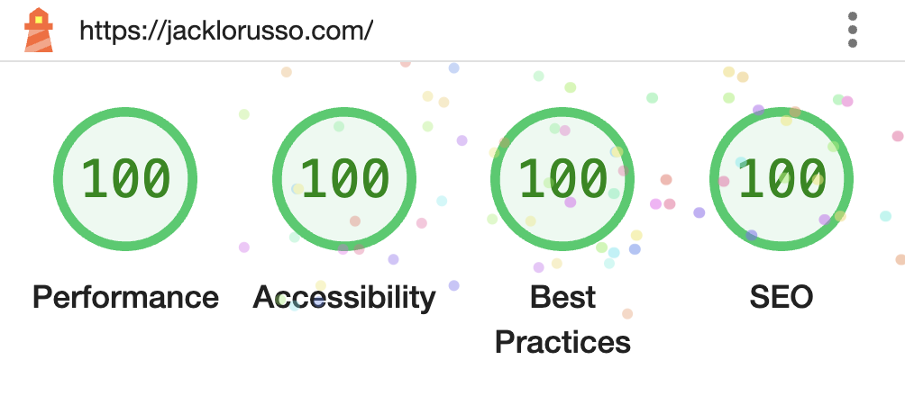

I didn't immediately jump aboard when I first came across the [Astro](https://astro.build) hype train. Another framework / static site generator (SSG)? Sure. Cool, I guess. But when inspiration struck and I was rebuilding jacklorusso.com on an impulse, I decided to give it a go.

TL;DR — I'm really happy with how it's turned out! Would recommend.

## Other options I (briefly) considered

Professionally, I've mostly been using Gatsby and a bit of Next.js when building websites in recent years. So why didn't I use them for this site?

### Gatsby

I've worked on a lot of Gatsby sites. [atlassian.design](https://atlassian.design/), our documentation site for the Atlassian Design System, is a Gatsby site. The old _old_ version of this site was a Gatsby jam — you can still reach a stripped-down version at this [Netlify url](https://jl-gatsby.netlify.app/). Even the travel blog I built for my girlfriend back in 2018 — [ninetyninedays.com.au](https://www.ninetyninedays.com.au/) — is also Gatsby under the hood. I've been there, and I've done that.

Look, Gatsby is fine. I'm not a total hater. I do think it is overkill for most sites _unless_ you're sourcing data from many different places — the GraphQL data layer doesn't really shine until it's reducing a whole bunch of glue code. There is a complexity inflection point that you need to reach before Gatsby is really working hard for you. If you're just dealing with some markdown files, it's a little over the top. Add in a headless CMS as an additional data source, plus another feed coming from somewhere else, and you might be close to getting bang for your buck, but even then... After working on around 6 Gatsby sites, I feel like the time you think you'll save with the unified GraphQL data layer, you just end up spending in different ways.

### Next.js

As for Next.js, it's great and I don't have anything really bad to say about it, except that it's probably just a bit much for a simple static site. It handles building full-stack web apps remarkably well and just keeps on getting better and better. Next.js is cool in that it handles SSG well _on top of_ everything else it does, but if you _only_ need the SSG part, I think there are better options out there.

Ultimately, for content-first websites I've become a "reject modernity, embrace tradition" guy. I want to avoid SPAs (single page applications), and roll with the old school multi-page architecture instead (is this really what we're calling it now?) Tools that embrace this as a core design decision are therefore most aligned with my goals. Which brings me to...

### Eleventy

I really love [Eleventy](https://www.11ty.dev/), and definitely recommend it, particularly if you want the _fastest_ builds, the _lowest_ barrier to getting started, and a large amount of control over the technology choices used to build your site (take your pick of templating language).

I mean it just doesn't get much easier than the Eleventy 'quick start':

```sh
echo '# Page header' > index.md
npx @11ty/eleventy
```

## If you love Eleventy so much why don't you marry it?

The real answer for why I didn't use Eleventy for this site is because curiosity got the best of me and I had to try the new shiny thing.

But also, Astro _is_ spiritually very similar to Eleventy. It makes a lot of the same tradeoffs. I'm pleasantly surprised that after using it for the first time, I actually like it even more!

## Now Astro is my best friend 🤝

I find the more opinionated design decisions to be refreshing, and they gel with me. I really like `.astro` files as they remind me of all the best parts of working with Vue (a minimal `.astro` file is just HTML — you can layer in scoped CSS and sprinkle JS as needed from there) _and_ React (JSX-like expressions), the two libraries/frameworks I have the most experience in. It just fits my preferences really well, and the project structure similarly fits like a glove with my mental models. I felt I was moving faster with Astro as a result.

That said though, that's just what works for me — if you look at an `.astro` file and you aren't into it (have a look at [this guide](https://docs.astro.build/en/core-concepts/astro-syntax/) to get an idea) or you'd just rather use a different templating language, stop right there, turn around, and use Eleventy with your preferred tech. I don't think you'll be disappointed.

The Astro docs and community do feel a bit more polished and user-friendly, which goes a really long way (never underestimate good design). I ended up starting with a really great theme — [chrismwilliams/astro-theme-cactus](https://github.com/chrismwilliams/astro-theme-cactus) — which was nice to get over that 'blank page' feeling. It's packed full of useful features such as a neat little search lib called [Pagefind](https://pagefind.app/) and Vercel's [Satori](https://github.com/vercel/satori) lib for generating Open Graph images and social cards. These are little 'nice-to-haves' that I probably wouldn't have bothered with myself, but since they're there already, why not! It also uses [Tailwind](https://tailwindcss.com/) which I definitely _would_ have bothered with myself. I'm a big fan of utility-first CSS in my personal projects because it helps me to 'design in the browser', fast.

So I spent a little time making the theme my own, changing things here and there... Look at me now. I have a new site, I really like the tech I'm using, [pnpm](https://pnpm.io/) + [Astro](https://astro.build/) combine for a super fast dev loop and build times (I only have a few pages right now, but my automatic Netlify build and deploy is done within the same minute of pushing a git commit), and a Chrome Lighthouse audit shows straight 100s. Let's go!


