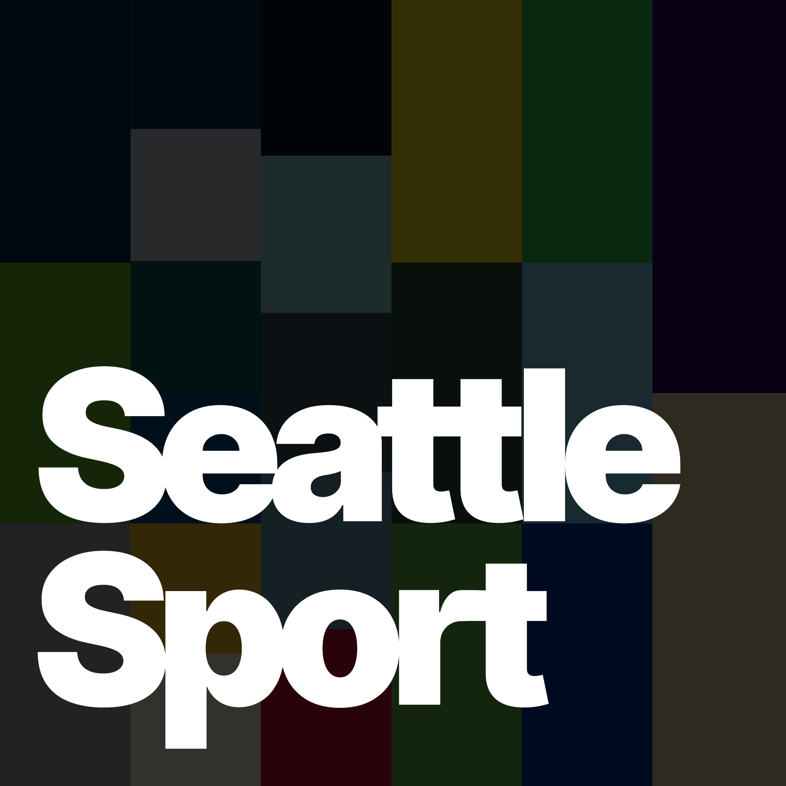

>Welcome to a new paradigm in social media where users have more choice and control. Our implementation of algorithmic choice lets users customize one of the most important parts of their social media experience: their feed.

Custom feeds are one of the best parts of Bluesky — if you want to learn more you can read their blog post [Algorithmic Choice with Custom Feeds](https://blueskyweb.xyz/blog/7-27-2023-custom-feeds).

So on the weekend I finally did something I've been wanting to do ever since I joined Bluesky: make my dream social media algorithm that **only shows me posts related to Seattle sport 😍**

## DIY... Or just use SkyFeed

The first and the biggest decision you have to make is whether you want to _really_ do-it-yourself and self-host an [ATProto](https://atproto.com) Feed Generator service. Bluesky have published a [starter kit on Github](https://github.com/bluesky-social/feed-generator) that can get you going, but you're going to have to be a software developer to make any way.

If you want to just get in there and mess around, there is a much easier way: use [SkyFeed](https://skyfeed.app)! Even though I am a developer I also ended up using the SkyFeed builder, mostly because I didn't want the maintenance cost/effort of running my own service. It doesn't have the _best_ UX — you're going to have to play around to get the hang of it — so I'll stop short of wholeheartedly endorsing it as a good option for people who aren't tech savvy, but this does have the lowest barrier to entry (for now).

## The Seattle Sport algorithm

Now I'm going to walk you through each composable piece of my custom feed. These are called 'blocks' in Skyfeed, but

## Show me the JSON

Even though I mostly used the UI to create the feed, occasionally I used the JSON editor. In any case, it's the easiest way to share it in this blog:

```json
{
  "displayName": "Seattle Sport",
  "license": "MIT",
  "blocks": [
    {
      "type": "input",
      "inputType": "did",
      "did": "did:plc:dj4vqszviionjofdjqkagexc",
      "collection": "post|reply|repost",
      "id": "aaae6l2b3s6nk"
    },
    {
      "type": "input",
      "inputType": "did",
      "did": "did:plc:dgpvzodkmckqpgmwoxezpwfs",
      "collection": "post|reply|repost",
      "id": "aaana2tppaxne"
    },
    {
      "type": "input",
      "inputType": "firehose",
      "firehoseSeconds": 604800,
      "id": "aaafjw5nv2ysa"
    },
    {
      "type": "regex",
      "value": "seattle\\s?kraken|sea\\s?kraken|kraken\\s?hockey|dave\\s?hakstol|grubauer|jared\\s?mccann|matty\\s?beniers|brandon\\s?tanev|mariners|sea\\s?us\\s?rise|luis\\s?castillo|logan\\s?gilbert|george\\s?kirby|bryce\\s?miller|julio\\s?rodriguez|cal\\s?raleigh|jp\\s?crawford|jarred\\s?kelenic|seahawks|pete\\s?carroll|geno\\s?smith|tyler\\s?lockett|dk\\s?metcalf|kenneth\\s?walker|bobby\\s?wagner|devon\\s?witherspoon|riq\\s?woolen|jamal\\s?adams|marshawn\\s?lynch|washington\\s?huskies|uw\\s?huskies|uw\\s?football|purple\\s?reign|go\\s?huskies|seattle\\s?storm|seattle\\s?sounders|sounders\\s?fc|ol\\s?reign",
      "caseSensitive": false,
      "target": "text|alt_text|link",
      "id": "aaafjw7oz4cb4"
    },
    {
      "type": "regex",
      "value": "nsfw|fursuit|furry",
      "caseSensitive": false,
      "invert": true,
      "target": "text|alt_text|link",
      "id": "aaafjyhwfrzdm"
    },
    {
      "type": "remove",
      "subject": "list",
      "value": null,
      "listUri": "at://did:plc:7dzg2vnr65pvlqgb2ziqgm4d/app.bsky.graph.list/3kccxi6msjt2a",
      "id": "aaafmc5ziqq5e"
    },
    {
      "type": "sort",
      "sortType": "created_at",
      "id": "aaafjsl56dvgi"
    }
  ]
}
```

## Logo

Of course, I had to give it a little logo and the beginnings of a brand identity system, didn't I?



I took the team colors of the Seattle teams that I support and the feed would cover — the Seahawks, Mariners, Kraken, Storm, Sounders and Washington Huskies — and created a sort of patchwork backdrop with each team represented in a vertical strip. Then I messed around with a few type treatments before I ended up just abusing Inter with some uncomfortably tight kerning and some sneaky vector edits to fake some ligatures between the 'tt' in Seattle and the 'rt' in Sport. Why? Because I felt like it.

## PS. Need a Bluesky invite?

Any friends I have reading this who want an invite to Bluesky, hit me up! I have a few kicking around.