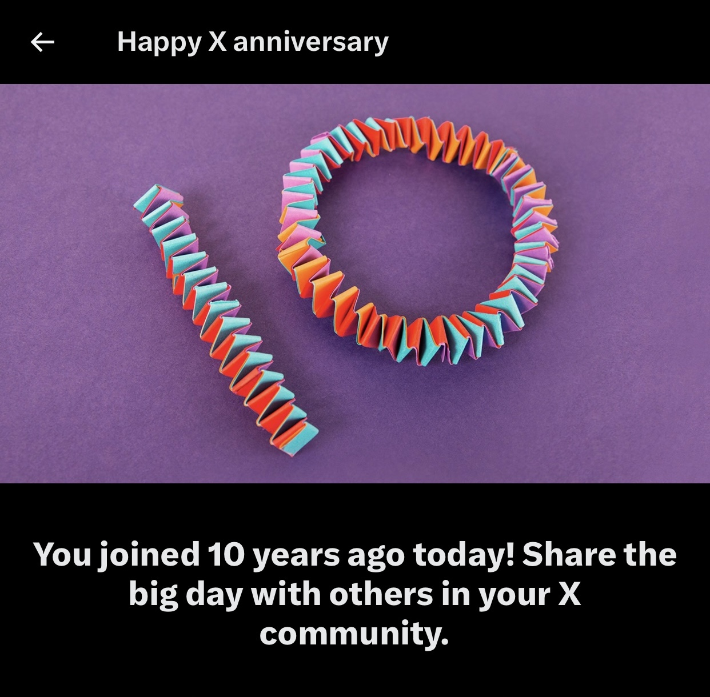

10 years of my tweets now live at [twitter.jacklorusso.com](https://twitter.jacklorusso.com) thanks to [Tweetback](https://github.com/tweetback/tweetback).

## RIP Twitter

I loved Twitter. I'm happy to admit it. I spent many years there, laughed a lot, learned a lot, met some great people, and just generally got far more personal and professional value out of it than any other social media platform.

Recently I logged in and was greeted with this:

It was bittersweet. The intrusion of the 'X' brand on the moment tainted any nostalgia I was feeling, although I had to note the opportunities for wordplay... Roman numeral for 10, my _**ex**_-community...

_Sidenote: I've actually been on Twitter for more than 10 years. I created an account when I was 14 and used it to exclusively talk about rugby league and my beloved St George Illawarra Dragons for a year or two before I got really self-conscious and embarrassed about it and deleted it. I wish I kept it!_

Twitter was a real micro-blog for me. A journal. Personal stories and photos (particularly ones that weren't aesthetic enough for platforms like Instagram), musings on design and web development, a **lot** of celebrating and moaning about my sports teams. Plus a whole bunch of conversations and interactions with others that helped shape me.

What if I want to keep all of this online, or at least have a say about taking it offline?

You can't rely on any social media platform to maintain your content and history in perpetuity — terms of service and even their very existence are inevitably subject to change. It has to be said that you _especially_ can't trust ~~Twitter~~ X right now.

Considering I will never tweet again (and wouldn't be caught dead 'x-ing' or 'posting an x'), who knows what Elon will do with my account? I wouldn't be surprised if it's days are numbered.

I also **really** wouldn't be surprised if they got rid of the ability to [download your twitter archive](https://help.twitter.com/en/managing-your-account/how-to-download-your-twitter-archive), or made it a paid feature. I figured I'd act now before it's too late.

## Tweetback saves the day

[Tweetback](https://github.com/tweetback/tweetback/) allows you to take ownership of your Twitter data and "get your tweets back". It's a project that takes your Twitter archive and builds an [Eleventy](https://www.11ty.dev) site where every tweet has its own independent URL (with backwards/forwards threading too!)

I definitely recommend it, it was extremely easy to get my archive site up and running.

Read ['Archive your tweets with Tweetback'](https://www.zachleat.com/web/tweetback/) by Zach Leatherman to learn more!

## Some fun stats from [twitter.jacklorusso.com](https://twitter.jacklorusso.com)

- 7,580 tweets
- My tweets have been given about ♻️ 1,350 retweets and ❤️ 23,128 likes
- I’ve retweeted other tweets 1,193 times (15.7%)
- 56.6% of my tweets are replies (×4,288)
- I used 473 unique emoji on 2,601 tweets (40.7% of all tweets)
- Top 5 emoji in order: 😍 ☺️ 😂 🙌 ✨
- I used 429 hashtags on 428 tweets (6.7% of all tweets)
- Top 5 hashtags in order: #design, #ux, #productdesign, #RedV, #sydcss

## Won't you just cause this problem for yourself again?

Yes, I am still using social media. I'm even still micro-blogging — you can follow me on [Bluesky](https://bsky.app/profile/jacklorusso.com) if you like.

But I'm encouraged by the direction of social networks like Bluesky and Mastodon that are embracing protocols over platforms, decentralization and portability. I think we are at a real social media crossroads, and there are some paths that are better than others. Some of the pitfalls of putting years of content into a siloed platform like Twitter can be avoided. I have more thoughts on this topic that I'll share another time.

More importantly though, I plan on using [jacklorusso.com](/) a whole lot more than in the past. Owning my content is more important to me now, and nothing beats posting on your own website.

## Gratitude

[Tweetback](https://github.com/tweetback/tweetback/) is awesome. Thank you to [Zach Leatherman](https://www.zachleat.com), [Nicolas Hoizey](https://nicolas-hoizey.com) and anyone else who worked on it.

I think it's really cool that I'm in control of 10 years of my micro-blogging history and content again. If my archive ever goes offline, it will be **my choice**.
