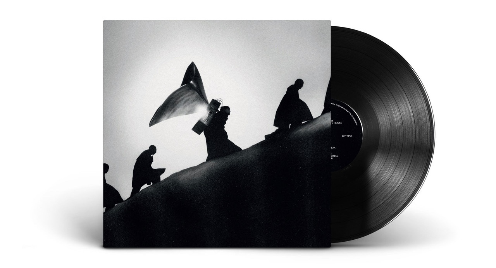

[James Blake's 'Playing Robots Into Heaven'](https://open.spotify.com/album/2ZwNcWl8h9blysDE8i4juL?si=UuhyQnB1TkuGa7mZSJ5D5A) is my pick for album of the year. I don’t even need to see what December brings — I’m calling it now.

Excellent release that calls back to his dubstep roots. It’s a real genre bender, with some pop and glitched-out moments mixed in for good measure. One to listen to through a nice pair of headphones or a good soundsystem!

Since this [#reco](/tags/reco) is doubling as my [#album-of-the-year](/tags/album-of-the-year) post, I’ll give an honourable mention to my runner-up: ['Mid Air' by Romy](https://open.spotify.com/album/7vQRJ5q9b0c4gKrsh9yIhE?si=WT_hQWyQRVe75fkmuKcRNA). The final member of [The xx](https://open.spotify.com/artist/3iOvXCl6edW5Um0fXEBRXy?si=4-upTWDPRNmqxhmltH8hbA) to release a solo album, this one was worth the wait. Danceable, ecstatic hyper-pop with some really beautiful, tender moments.

It’s kind of nostalgic: these recos would feel right at home in my 2009-2013 era of music. I guess I haven't changed all that much!
