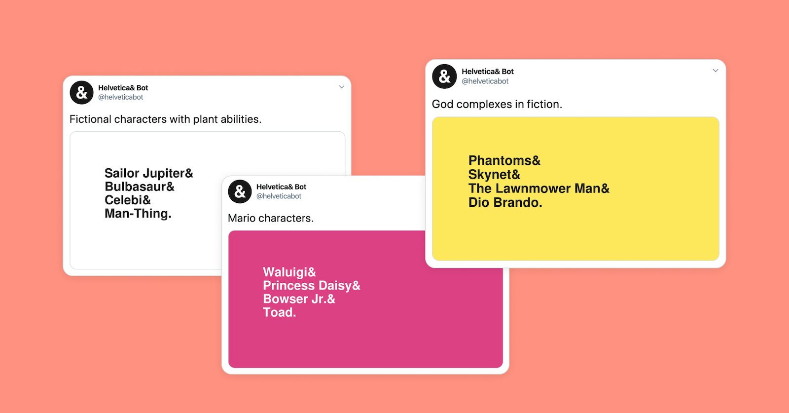
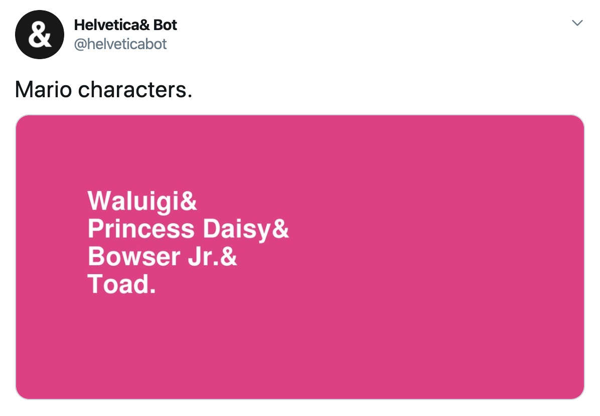
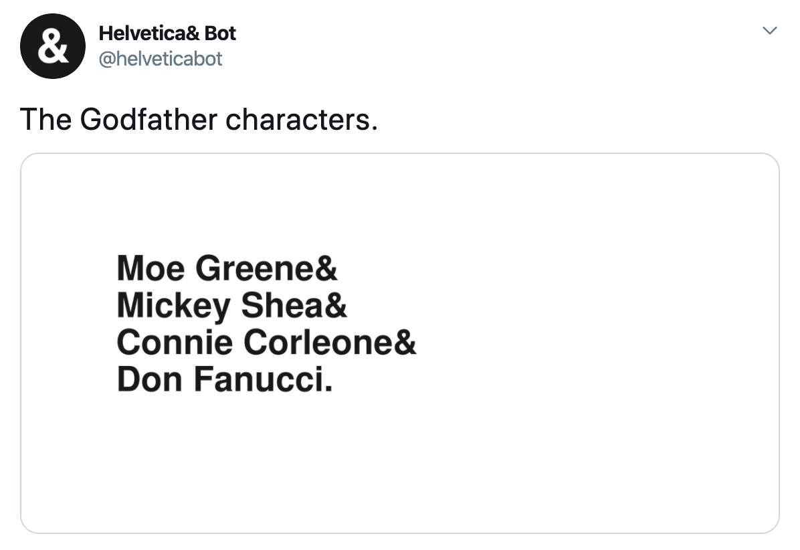
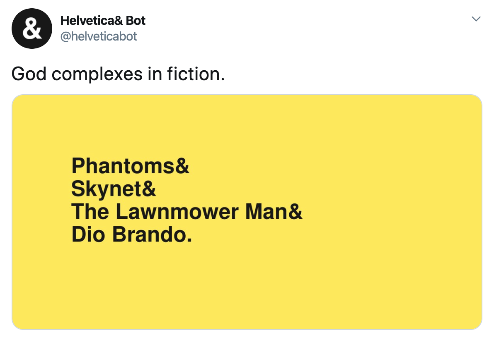
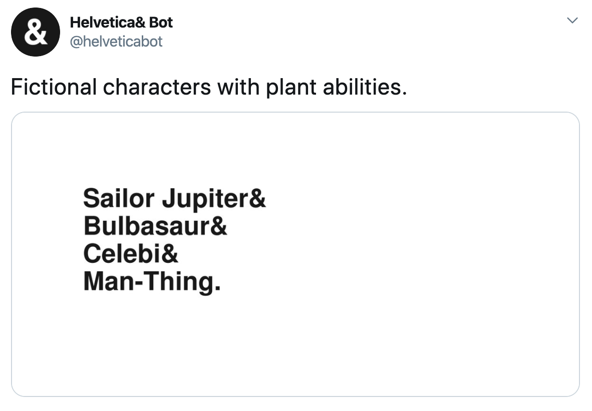
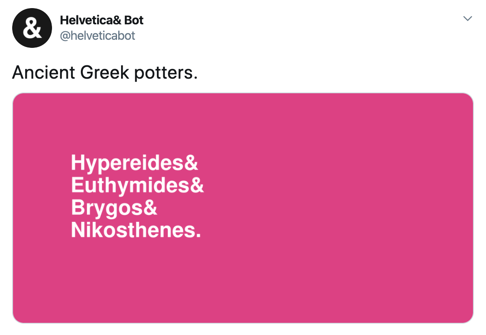
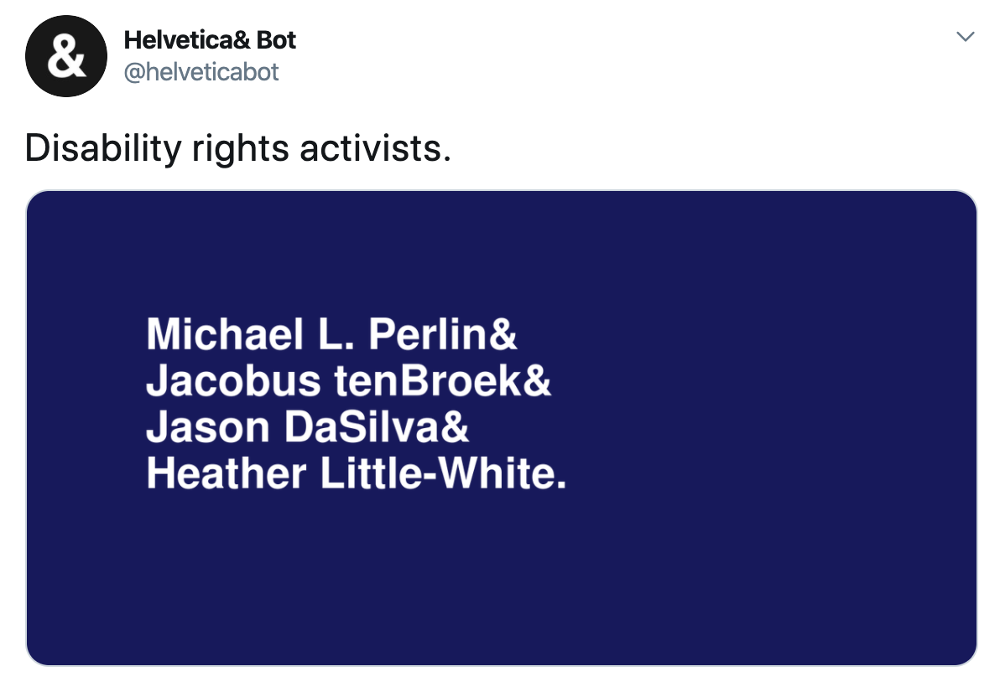
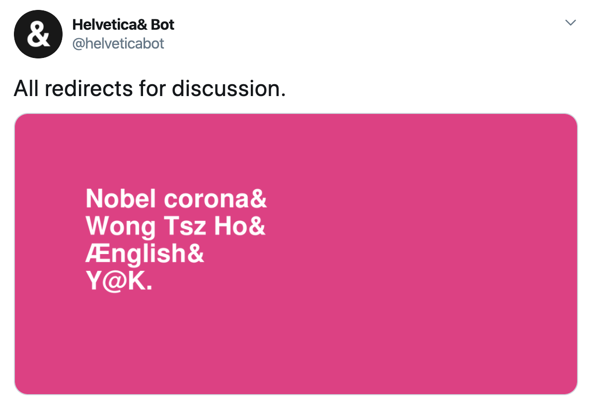
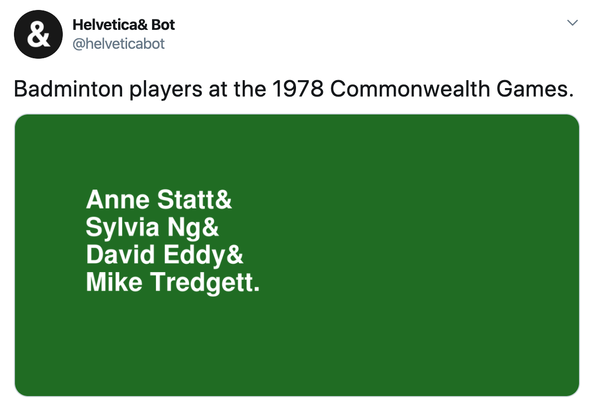

Back in the day I made a Twitter bot that generates designs inspired by the classic 'John & Paul & Ringo & George' t-shirt. I brought it back to life for Bluesky!

[View Helvetica Bot on Bluesky](https://bsky.app/profile/helveticabot.jacklorusso.com)

## Origin story 

I built this project in a rush of pure inspiration. It was 2018, I was sitting in a café in Prague and I had just finished reading Darius Kazemi's write-up of [how he made his Bracket Meme Bot using the Wikipedia API](http://tinysubversions.com/notes/bracket-meme-bot/) (if you're into computational creativity and you're not familiar with his work, you should definitely [check him out](http://tinysubversions.com/bio.html)). I looked up from my laptop and immediately noticed somebody wearing a "John & Paul & Ringo & George" t-shirt. An idea for a new Twitter bot just fell right into my lap.

The design of these t-shirts is so simple, yet visually striking, that it has spawned countless imitations. The concept of taking a well known group (like the Beatles) and listing it's members one by one hits an interesting balance; you show your allegiance to a group without necessarily using the "brand name" itself. It has the effect of a nod between people "in the know", especially when the groups used are quite obscure. If you're interested in reading a little more about the origins of the design and the people behind it, you should check out [this article](https://www.jetset.nl/archive/john-paul-ringo-george) from the archives of the iconic design studio Experimental Jetset. I love how they frame the underlying idea of the design: "pop-cultural imagery 'abstracted' through text".

Back to the bot!

It works by using the Wikipedia API to select a random Wikipedia Category that has a plural noun in its title. It then gets the list of Pages in the Category, and picks 4 at random to draw to a canvas before posting via the ATProto API. A Github Action that I set up with an hourly cron jon wakes up the bot and triggers the process.

## Selected examples

Sometimes the bot follows the traditional pop-culture format of the original inspiration material.

Sometimes the categories that the bot chooses are significantly more obscure...

Sometimes the bot teaches you a little about history or biology.

Sometimes it highlights members of less well-known groups that people really _should_ know.

Sometimes the bot reveals a little bit about how Wikipedia itself actually works. Here are some terms that are under discussion for whether to implement an automatic redirect — some contemporary news has snuck in. Clearly enough people are misspelling 'Novel Corona' (virus) that Wikipedia is considering automatically redirecting!

... and sometimes the categories are just so damn specific that it's just kind of funny to imagine a tshirt being made for them.

## Making a Bluesky bot

Thanks to [Monica Powell](https://github.com/M0nica/bluesky-artbot) and [Phil Nash](https://github.com/philnash/bsky-bot) for their projects that I used as a reference. Monica's repo helped me figure out how to post images to Bluesky and Phil's showed me how to use Github actions to keep Helvetica bot running. I definitely recommend checking these projects out if you're interested!

You'll always know if a Bluesky bot is made by me because the handle will be a subdomain of mine — in this case, [helveticabot.jacklorusso.com](https://bsky.app/profile/helveticabot.jacklorusso.com). I'll be writing a follow-up post on this topic because I learned a few things this week.

## Lessons Learned

Something that I'd never really considered back when I put this bot together was the fact that the bot might put some extremely uncomfortable or disturbing content out there. I'm using a word filter for some common "naughty" words, but didn't think about the fact that words like "disasters", "wars", "deaths", etc. were all words that aren't inherently controversial... They only become controversial when they are used in situations like a bot that randomly uses them to generate a t-shirt design. I've had to update the word filter multiple times to ensure my little art project isn't accidentally making people uncomfortable.

Bots can be a handful, let me tell you that.
