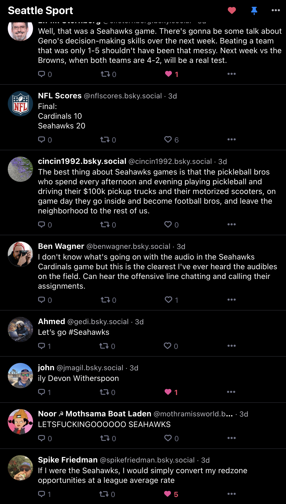
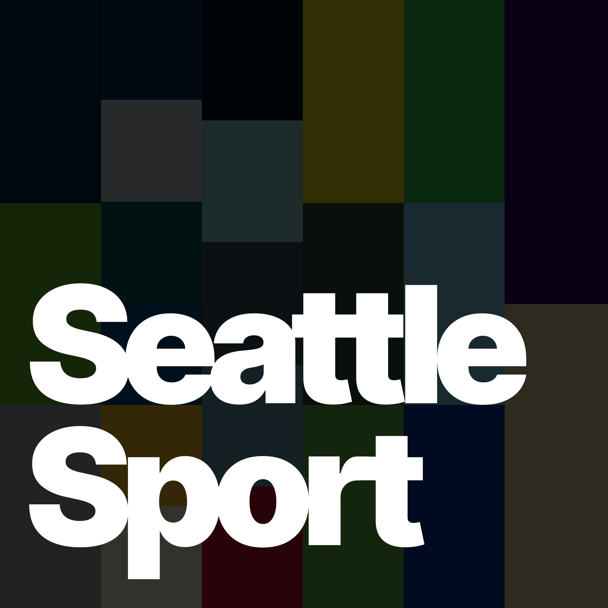
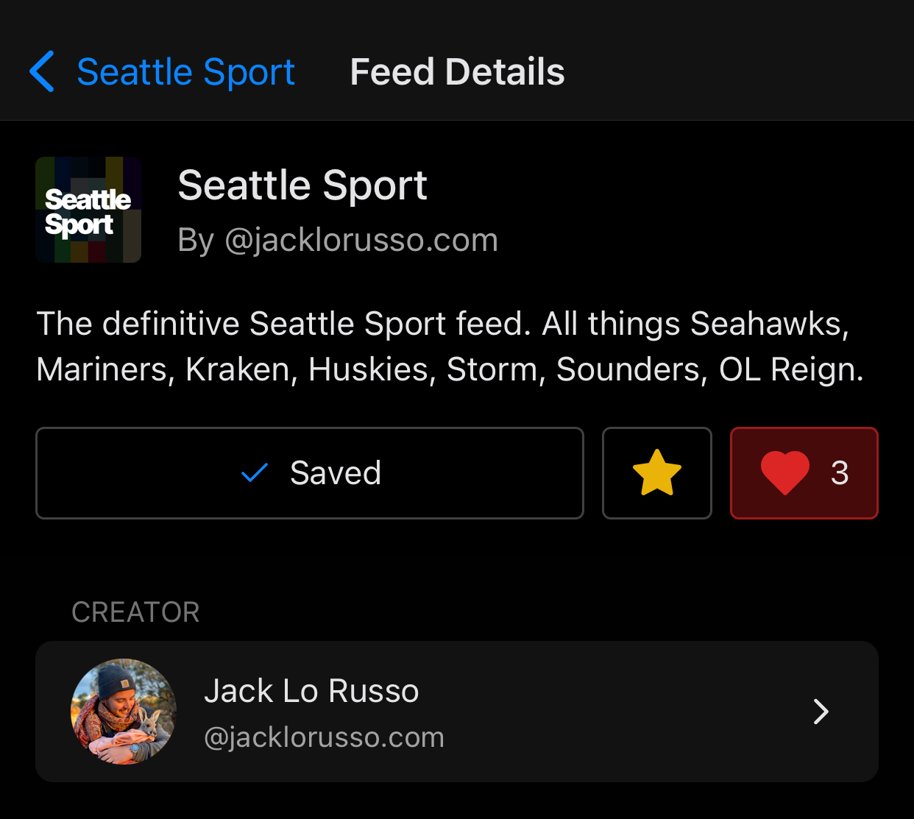
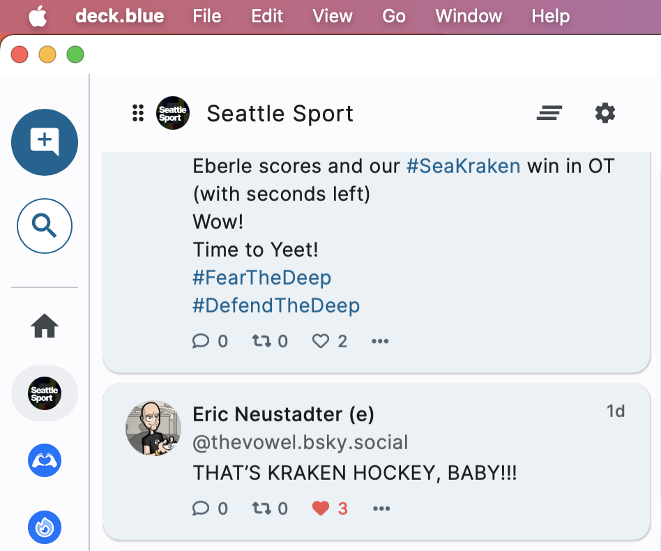
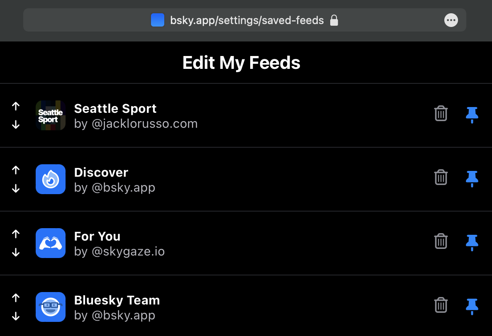

> Welcome to a new paradigm in social media where users have more choice and control. Our implementation of algorithmic choice lets users customize one of the most important parts of their social media experience: their feed.

Custom feeds are one of the best parts of Bluesky — if you want to learn more you can read their blog post [Algorithmic Choice with Custom Feeds](https://blueskyweb.xyz/blog/7-27-2023-custom-feeds).

So on the weekend I finally did something I've been wanting to do ever since I joined Bluesky: make my dream social media algorithm that **only shows me posts related to Seattle sport 😍**

It's live — go ahead and check out the [Seattle Sport feed on Bluesky](https://bsky.app/profile/did:plc:7dzg2vnr65pvlqgb2ziqgm4d/feed/aaana2tpo7js6)!

Hopefully this post is helpful for anyone who wants to make their own feed, or just wants a peek into my process.

## DIY... Or just use SkyFeed

The first and the biggest decision you have to make is whether you want to _really_ do-it-yourself and self-host an [ATProto](https://atproto.com) Feed Generator service. Bluesky have published a [starter kit on Github](https://github.com/bluesky-social/feed-generator) that can get you going, but you're going to have to be a software developer to make any ground.

If you just want to get in there and mess around, there is a much easier way: use [SkyFeed](https://skyfeed.app)!

I ended up using the SkyFeed builder, mostly because I didn't want the maintenance cost/effort of running my own service. It doesn't have the _best_ UX — you're going to have to play around to get the hang of it — so I'll stop short of wholeheartedly endorsing it as a good option for people who aren't tech savvy. Skyfeed certainly lowers the barrier to entry though. It has a preview of your feed as you build, you can publish your feed easily and then use it in Bluesky right away. Pretty neat!

## The Seattle Sport algorithm

Now I'm going to walk you through each composable piece of my custom feed. These are called 'blocks' in Skyfeed, and are evaluated top down.

1. `input` blocks from certain official team accounts and dedicated news sources. Since it is the early days of Bluesky still, there aren't too many of them out there. [@seahawks.team](https://bsky.app/profile/seahawks.team) and [Davy Jones' Locker Room](https://bsky.app/profile/davyjoneslr.bsky.social) were the first examples I could find. Hot tip: you'll need to use the DID of an account, not their handle; you can [use this link to resolve a handle to a DID](https://bsky.social/xrpc/com.atproto.identity.resolveHandle?handle=seahawks.team) (just change the ?handle param in the URL).
2. `input` block for the the entire 'firehose' — all posts on Bluesky! We need this data stream to start filtering on below.
3. `regex` block for keywords to look for in posts that I want _included_ in the feed. Filter that firehose down to stuff we care about! Variations of team names, catchphrases, hashtags, coach and player names, even the names of some former legends like Marshawn Lynch that everyone still wants to hear about. This is the block that I'll still be adding to and tweaking the most. We target text, alt text, and links — anything that could contain the keyword.
4. `regex` block for keywords to filter on or _exclude_ from the feed. Honestly, you'd be surprised, but even after only including Seattle sport related keywords you'll still get the occasional dick pic (from a guy in a Seahawks jersey) or a sport loving furry. Which brings us to the next block...
5. `remove` block with a link to a Mute List in Bluesky that I can maintain from the app as I browse. Any time I see spam or NSFW content, I can add them to the mute list and they'll be excluded from the feed for everyone. Hot tip: just do exactly this for any feed you create. It's the best way to be an ongoing maintainer/moderator/curator without needing to go back and edit your algorithm.
6. `sort` block, by `created_at`. Finally, lets sort all our remaining posts — I've chosen this to be a chronological feed so it's always timely, so it's the most fun during live games. Another interesting option you can pick here is a ['Hacker News' style ranking algorithm](https://medium.com/hacking-and-gonzo/how-hacker-news-ranking-algorithm-works-1d9b0cf2c08d) that is more popularity-based, and you can control the weighting that new posts get to keep it fresh. Hot tip: unless you're doing something extra funky in your feed design, your sort block needs to come last, or any block that comes after it won't be sorted!

And that's it! For any interest-based feed it's probably going to look very similar. Of course, you can do a lot more than includes and excludes when designing a custom algorithm, but for my purposes this is near perfect.

It was a lot of fun surfing the feed during the Seahawks game against Arizona — this was it's first real workout and it did great!



## Logo talk

Now, of course, I had to give it a little logo and the beginnings of a brand identity system, didn't I? Here's where I first landed:



I took the official listed team colors of the Seattle teams that I support and that the feed covered — the Seahawks, Mariners, Kraken, Storm, Sounders and Washington Huskies — and created a sort of patchwork backdrop with each team represented in a vertical strip.

Then I messed around with a few type treatments before I ended up just abusing Inter with some uncomfortably tight kerning and some sneaky vector edits to fake some ligatures between the 'tt' in Seattle and the 'rt' in Sport. Why? Honestly, I just did it. It's a personal project and I was sitting in a cafe, jamming.

Later on in the week I played with some variations of the theme, after I saw how the logo/icon/avatar was sitting in situ in the Bluesky app and 3rd-party clients such as [Graysky](https://graysky.app) and [deck.blue](https://deck.blue) (both of which I definitely recommend checking out — both are arguably better than the official app in very different ways).


Ultimately I stuck with a simplified and centred version of the original logotype concept (the last two variants in the image above). It was deck.blue that made me shift away from the original bottom-left placement of the logotype to a more centred placement; deck.blue renders these avatars as circles, which was a good thing to realise.

Now I'm pretty happy with how it looks in situ; even if most feeds tend to use an icon for the avatar, for good reason — they are scaled down pretty small in some cases. Here's a smattering of screens from different clients.

Graysky:


deck.blue:


bsky.app:


## Show me the JSON

If for some reason you're interested in what the feed actually looks like under the hood at this point in time, here it is. These are the blocks I described earlier.

```json
{
  "displayName": "Seattle Sport",
  "license": "MIT",
  "blocks": [
    {
      "type": "input",
      "inputType": "did",
      "did": "did:plc:dj4vqszviionjofdjqkagexc",
      "collection": "post|reply|repost",
      "id": "aaae6l2b3s6nk"
    },
    {
      "type": "input",
      "inputType": "did",
      "did": "did:plc:dgpvzodkmckqpgmwoxezpwfs",
      "collection": "post|reply|repost",
      "id": "aaana2tppaxne"
    },
    {
      "type": "input",
      "inputType": "firehose",
      "firehoseSeconds": 604800,
      "id": "aaafjw5nv2ysa"
    },
    {
      "type": "regex",
      "value": "seattle\\s?kraken|sea\\s?kraken|kraken\\s?hockey|dave\\s?hakstol|grubauer|jared\\s?mccann|matty\\s?beniers|brandon\\s?tanev|mariners|sea\\s?us\\s?rise|luis\\s?castillo|logan\\s?gilbert|george\\s?kirby|bryce\\s?miller|julio\\s?rodriguez|cal\\s?raleigh|jp\\s?crawford|jarred\\s?kelenic|seahawks|pete\\s?carroll|geno\\s?smith|tyler\\s?lockett|dk\\s?metcalf|kenneth\\s?walker|bobby\\s?wagner|devon\\s?witherspoon|riq\\s?woolen|jamal\\s?adams|marshawn\\s?lynch|washington\\s?huskies|uw\\s?huskies|uw\\s?football|purple\\s?reign|go\\s?huskies|seattle\\s?storm|seattle\\s?sounders|sounders\\s?fc|ol\\s?reign",
      "caseSensitive": false,
      "target": "text|alt_text|link",
      "id": "aaafjw7oz4cb4"
    },
    {
      "type": "regex",
      "value": "nsfw|fursuit|furry",
      "caseSensitive": false,
      "invert": true,
      "target": "text|alt_text|link",
      "id": "aaafjyhwfrzdm"
    },
    {
      "type": "remove",
      "subject": "list",
      "value": null,
      "listUri": "at://did:plc:7dzg2vnr65pvlqgb2ziqgm4d/app.bsky.graph.list/3kccxi6msjt2a",
      "id": "aaafmc5ziqq5e"
    },
    {
      "type": "sort",
      "sortType": "created_at",
      "id": "aaafjsl56dvgi"
    }
  ]
}
```

## PS. Need a Bluesky invite?

Anyone reading this who wants an invite to Bluesky, hit me up — I have a few kicking around. If you read this far, you deserve one!
